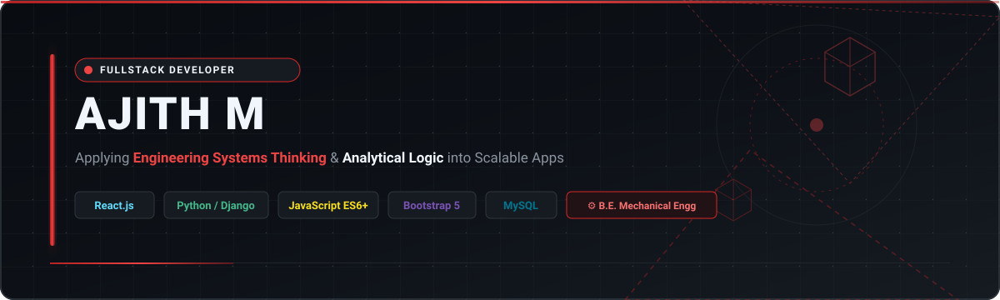
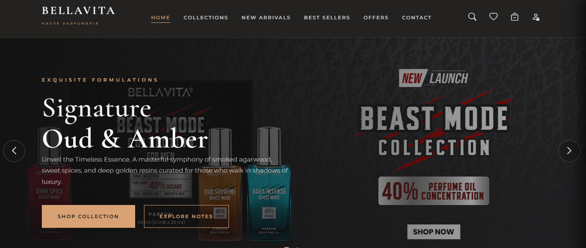
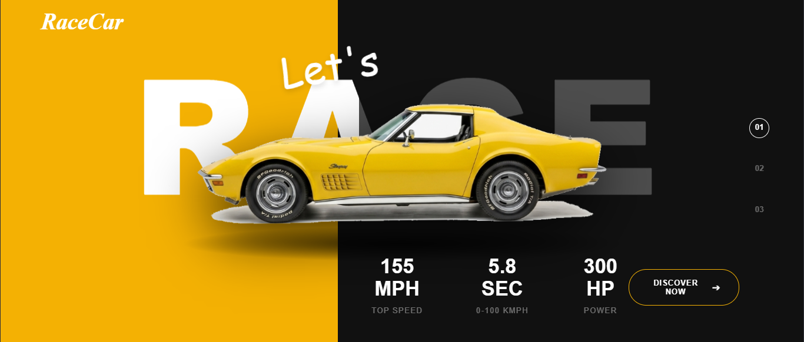
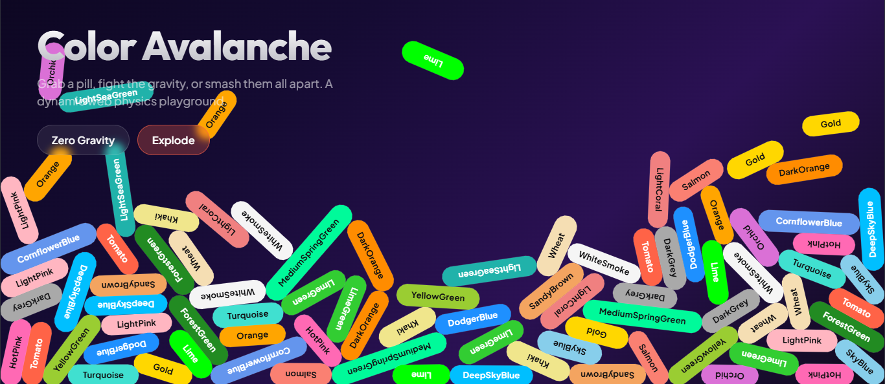

  

 

 

<!-- ABOUT ME & ENGINEERING PHILOSOPHY CARD -->
<table width="100%" style="font-family: 'Segoe UI', 'Inter', system-ui, -apple-system, BlinkMacSystemFont, Roboto, sans-serif;">
  <tr>
    <td bgcolor="#0D1117" style="border: 2px solid #DC2626; border-radius: 12px; padding: 24px;">
      <table width="100%" border="0">
        <tr>
          <td width="25%" align="center" valign="middle">
            
          </td>
          <td width="75%" valign="top" style="padding-left: 20px;">
            <h2 align="left" style="color: #F0F6FC; border-bottom: 2px solid #DC2626; padding-bottom: 8px; font-family: 'Segoe UI', 'Inter', sans-serif; font-weight: 700;">
              ⚡ Mechanical Engineering &rarr; Full-Stack Web Engineering
            </h2>
            

              Hello! I'm <b>Ajith M</b>, a Full-Stack Web Engineer with a strong foundational degree in <b>B.E. Mechanical Engineering</b>. I bridge physical engineering logic with modern full-stack software architecture.
            

            

              🎯 <b>Core Philosophy:</b> Applying structural systems thinking, root-cause troubleshooting, and algorithmic rigor to architect scalable, high-performance web applications. Focused on modular design patterns, clean code principles, and efficient data handling.
            

          </td>
        </tr>
      </table>
    </td>
  </tr>
</table>

 

<!-- TECH STACK MATRIX -->
<h2 align="left" style="color: #F0F6FC; font-family: 'Segoe UI', 'Inter', sans-serif; font-weight: 700;">🛠️ Technical Skills &amp; Stack</h2>

<table width="100%" style="font-family: 'Segoe UI', 'Inter', system-ui, -apple-system, BlinkMacSystemFont, Roboto, sans-serif;">
  <tr>
    <th width="30%" bgcolor="#161B22" style="color: #EF4444; border: 1px solid #30363D; padding: 10px; font-size: 16px; font-family: 'Segoe UI', 'Inter', sans-serif;">Category</th>
    <th width="70%" bgcolor="#161B22" style="color: #F0F6FC; border: 1px solid #30363D; padding: 10px; font-size: 16px; font-family: 'Segoe UI', 'Inter', sans-serif;">Technologies &amp; Tools</th>
  </tr>
  <tr>
    <td bgcolor="#0D1117" style="color: #F0F6FC; border: 1px solid #30363D; padding: 12px; font-weight: bold; font-family: 'Segoe UI', 'Inter', sans-serif;">
      🎨 Frontend Engineering
    </td>
    <td bgcolor="#0D1117" style="border: 1px solid #30363D; padding: 12px;">
      
      
      
      
      
    </td>
  </tr>
  <tr>
    <td bgcolor="#0D1117" style="color: #F0F6FC; border: 1px solid #30363D; padding: 12px; font-weight: bold; font-family: 'Segoe UI', 'Inter', sans-serif;">
      ⚙️ Backend &amp; Database
    </td>
    <td bgcolor="#0D1117" style="border: 1px solid #30363D; padding: 12px;">
      
      
      
    </td>
  </tr>
  <tr>
    <td bgcolor="#0D1117" style="color: #F0F6FC; border: 1px solid #30363D; padding: 12px; font-weight: bold; font-family: 'Segoe UI', 'Inter', sans-serif;">
      🧰 Tools &amp; Workflow
    </td>
    <td bgcolor="#0D1117" style="border: 1px solid #30363D; padding: 12px;">
      
      
      
    </td>
  </tr>
</table>

 

<!-- FEATURED PROJECTS -->
<h2 align="left" style="color: #F0F6FC; font-family: 'Segoe UI', 'Inter', sans-serif; font-weight: 700;">🚀 Top Featured Projects</h2>

<!-- PROJECT 1 -->
<table width="100%" style="font-family: 'Segoe UI', 'Inter', system-ui, -apple-system, BlinkMacSystemFont, Roboto, sans-serif;">
  <tr>
    <td bgcolor="#0D1117" style="border: 2px solid #DC2626; border-radius: 12px; padding: 20px;">
      <table width="100%" border="0">
        <tr>
          <td width="50%" valign="top">
            
          </td>
          <td width="50%" valign="top" style="padding-left: 20px;">
            <h3 style="color: #EF4444; margin-top: 0; font-family: 'Segoe UI', 'Inter', sans-serif; font-weight: 700;">💎 Bella Vita Luxury Landing Page</h3>
            

              A high-converting, luxury aesthetic ecommerce landing showcase engineered with smooth visual hierarchy, responsive grid structures, and interactive UI micro-animations.
            

            

              <b>Key Features:</b> Dynamic product showcase grids, mobile-first responsive layout, and cross-browser optimization.
            

            

              
              
              
              
            

             
            
            &nbsp;
            
          </td>
        </tr>
      </table>
    </td>
  </tr>
</table>

 

<!-- PROJECT 2 -->
<table width="100%" style="font-family: 'Segoe UI', 'Inter', system-ui, -apple-system, BlinkMacSystemFont, Roboto, sans-serif;">
  <tr>
    <td bgcolor="#0D1117" style="border: 2px solid #DC2626; border-radius: 12px; padding: 20px;">
      <table width="100%" border="0">
        <tr>
          <td width="50%" valign="top">
            
          </td>
          <td width="50%" valign="top" style="padding-left: 20px;">
            <h3 style="color: #EF4444; margin-top: 0; font-family: 'Segoe UI', 'Inter', sans-serif; font-weight: 700;">🏎️ Car Skew 3D Perspective Showcase</h3>
            

              An interactive visual experience utilizing advanced CSS3 perspective transformations and JavaScript event handlers to project 3D skewed vehicle presentations.
            

            

              <b>Key Features:</b> Hardware-accelerated CSS 3D matrix transforms, interactive mouse-tracking visual perspective, and fluid frame rates.
            

            

              
              
              
            

             
            
            &nbsp;
            
          </td>
        </tr>
      </table>
    </td>
  </tr>
</table>

 

<!-- PROJECT 3 -->
<table width="100%" style="font-family: 'Segoe UI', 'Inter', system-ui, -apple-system, BlinkMacSystemFont, Roboto, sans-serif;">
  <tr>
    <td bgcolor="#0D1117" style="border: 2px solid #DC2626; border-radius: 12px; padding: 20px;">
      <table width="100%" border="0">
        <tr>
          <td width="50%" valign="top">
            
          </td>
          <td width="50%" valign="top" style="padding-left: 20px;">
            <h3 style="color: #EF4444; margin-top: 0; font-family: 'Segoe UI', 'Inter', sans-serif; font-weight: 700;">🎨 Color Pill Interactive Palette Generator</h3>
            

              A sleek web application for dynamic color code generation, palette manipulation, and instant clipboard hex/RGB copying designed for UI/UX developers.
            

            

              <b>Key Features:</b> Real-time DOM color manipulation, instant clipboard integration, and custom color scale generators.
            

            

              
              
              
            

             
            
            &nbsp;
            
          </td>
        </tr>
      </table>
    </td>
  </tr>
</table>

 

<!-- CONNECT & CONTACT FOOTER -->
<table width="100%" style="font-family: 'Segoe UI', 'Inter', system-ui, -apple-system, BlinkMacSystemFont, Roboto, sans-serif;">
  <tr>
    <td bgcolor="#0D1117" align="center" style="border: 1px solid #30363D; border-radius: 12px; padding: 20px;">
      <h3 style="color: #F0F6FC; margin-bottom: 10px; font-family: 'Segoe UI', 'Inter', sans-serif; font-weight: 700;">🤝 Let's Connect &amp; Build Together</h3>
      

        Open to full-stack web engineering roles, collaborative software projects, and technical discussions.
      

      
      &nbsp;&nbsp;
      
    </td>
  </tr>
</table>
